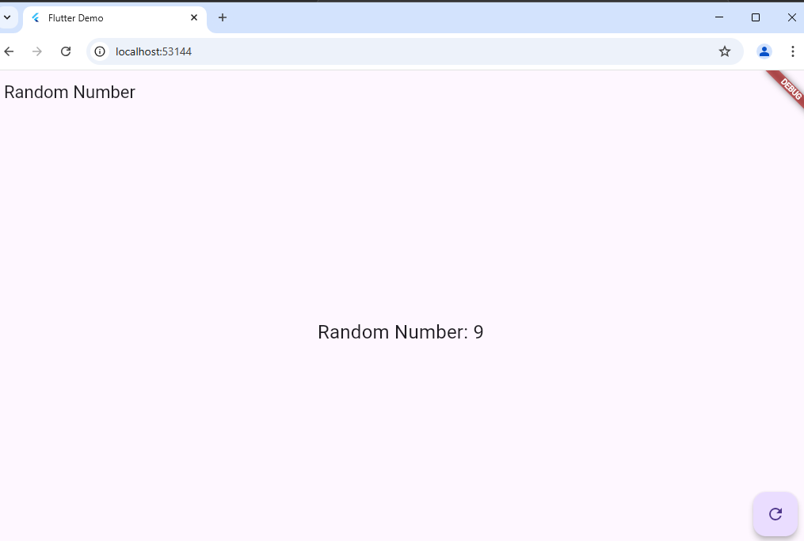

# bloc_random_jejen

A new Flutter project.

Praktikum 7: BLoC Pattern

## Getting Started

**Soal 13**

- Jelaskan maksud praktikum ini ! Dimanakah letak konsep pola BLoC-nya ?

Praktikum ini bertujuan untuk memperkenalkan dan mengimplementasikan konsep BLoC (Business Logic Component) dalam pengembangan aplikasi Flutter. Dalam konteks ini, BLoC digunakan untuk memisahkan logika bisnis (misalnya, menghasilkan angka acak) dari tampilan (UI) dalam aplikasi, yang menjadikan aplikasi lebih mudah dipelihara dan lebih terstruktur.

**Maksud Praktikum ini:**

1. Pemisahan antara UI dan Logika Bisnis (Business Logic):

    - Aalah satu tujuan utama penggunaan BLoC adalah untuk memisahkan antara UI (interface pengguna) dan logika 
      bisnis (proses yang dilakukan di dalam aplikasi). Dengan pemisahan ini, kita bisa lebih mudah mengelola dan menguji logika aplikasi tanpa terikat pada tampilan yang mungkin sering berubah.
    
    - Pada praktikum ini, logika bisnis yang dimaksud adalah menghasilkan angka acak. Tampilan (UI) hanya 
      bertugas untuk menampilkan angka tersebut, sementara logika untuk menghasilkan angka acak berada di dalam BLoC.

2. Menggunakan Stream dan Sink untuk Mengatur Alur Data:

    BLoC menggunakan Stream untuk mengalirkan data, dan Sink untuk mengirim data ke dalam stream. Di sini, stream digunakan untuk menghasilkan angka acak, dan sink digunakan untuk memicu pembuatan angka acak tersebut.

3. Memanfaatkan StreamBuilder untuk Menghubungkan UI dan BLoC:

Di aplikasi Flutter, StreamBuilder adalah widget yang memantau stream dan memperbarui UI setiap kali ada perubahan data. Dalam praktikum ini, StreamBuilder<int> digunakan untuk memantau stream angka acak yang dihasilkan oleh BLoC dan memperbarui UI untuk menampilkan angka acak terbaru.

**Letak Konsep Pola BLoC dalam Praktikum Ini:**

Konsep BLoC diterapkan pada beberapa bagian berikut:

1. BLoC Class (RandomNumberBloc):

    - StreamController digunakan untuk menangani aliran data (stream). Dalam hal ini, ada dua stream:

        - _generateRandomController: Stream yang bertanggung jawab untuk memicu penghasilan angka acak. Sink 
          ini menerima input berupa event, yang dalam hal ini adalah pemicu (generateRandom).

        - _randomNumberController: Stream yang mengirimkan data hasil dari logika bisnis, yaitu angka acak yang 
          dihasilkan. Stream ini digunakan untuk mengirimkan angka acak ke UI.

    - RandomNumberBloc adalah kelas yang mengatur aliran data, di mana stream ini diproses dan dipertukarkan 
      antara komponen UI dan logika bisnis.

2. Sink dan Stream pada BLoC:

    - Sink (generateRandom) digunakan untuk mengirimkan sinyal bahwa angka acak harus dihasilkan.

    - Stream (randomNumber) digunakan untuk mengalirkan angka acak kepada UI.

Dengan cara ini, aplikasi tidak mengandalkan pengelolaan state secara langsung di dalam UI, melainkan di dalam BLoC.

3. UI (Tampilan) dengan StreamBuilder:

    - StreamBuilder adalah widget yang mendengarkan stream dan memperbarui UI saat ada data baru yang diterima 
      dari stream. Di sini, StreamBuilder mendengarkan stream randomNumber dan memperbarui tampilan setiap kali angka acak baru dihasilkan oleh BLoC.

- Capture hasil praktikum Anda berupa GIF dan lampirkan di README.
  Lalu lakukan commit dengan pesan "P7: Jawaban Soal 13".

